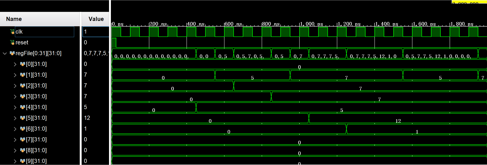
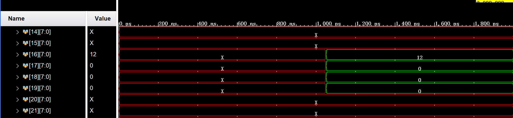

## **MIPS Multicycle Implementation**

### Target

* Understand the **pipeline** of the CPU, and related concept: **dependence** and **hazard**
* Design pipelined CPUs to support stalls and address **data, control, and structure risks**.
* Add **forwarding** mechanism, improving Pipeline Processor Performance

### Module Description

To implement instruction-level parallel execution, the pipeline needs to be divided into stages: **IF, ID, EX, MEM, and WB**.

### Pipeline Register

```verilog
// IF/ID
reg [31:0] IFID_pcPlus4, IFID_instr;
wire [4:0] IFID_INSTRS = IFID_instr[25:21], IFID_INSTRT = IFID_instr[20:16],
IFID_INSTRD = IFID_instr[15:11];

// ID/EX
reg [31:0] IDEX_readData1, IDEX_readData2, IDEX_immSext;
reg [4:0] IDEX_instrRs, IDEX_instrRt, IDEX_instrRd;
reg [8:0] IDEX_ctrl;
wire [1:0] IDEX_ALUOP = IDEX_ctrl[7:6];
wire IDEX_REGDST = IDEX_ctrl[8], IDEX_ALUSRC= IDEX_ctrl[5], IDEX_BRANCH = IDEX_ctrl[4], IDEX_MEMREAD = IDEX_ctrl[3], IDEX_MEMWRITE = IDEX_ctrl[2], IDEX_REGWRITE = IDEX_ctrl[1],
IDEX_MEMTOREG = IDEX_ctrl[0];

// EX/EM
reg [31:0] EXMEM_aluRes, EXMEM_writeData;
reg [4:0] EXMEM_dstReg;
reg [4:0] EXMEM_ctrl;
reg EXMEM_zero;
wire EXMEM_BRANCH = EXMEM_ctrl[4], EXMEM_MEMREAD = EXMEM_ctrl[3],
EXMEM_MEMWRITE = EXMEM_ctrl[2], EXMEM_REGWRITE = EXMEM_ctrl[1],
EXMEM_MEMTOREG = EXMEM_ctrl[0];

// MEM/WB
reg [31:0] MEMWB_readData, MEMWB_aluRes;
reg [4:0] MEMWB_dstReg;
reg [1:0] MEMWB_ctrl;
wire MEMWB_REGWRITE = MEMWB_ctrl[1], MEMWB_MEMTOREG = MEMWB_ctrl[0];
```

### Implementation of each stage

**Notice：** Register groups and data storage are written along the descending edge of the clock, and pipeline registers are written along the rising edge of the clock.

#### IF

PC is also updated with the clock rising edge. PC and IF/ID pipeline registers cannot be updated at this time because the program cannot execute forward when a pause is inserted. At the same time, in order to control the risk, when a conditional jump occurs, it is necessary to flush out the previously taken instructions.

```verilog
reg [31:0] PC;
wire [31:0] PC_PLUS_4, BRANCH_ADDR, NEXT_PC, IF_INSTR;
wire BRANCH;
assign PC_PLUS_4 = PC + 4;
Mux32 nextPCMux(.in0(PC_PLUS_4), .in1(BRANCH_ADDR), .out(NEXT_PC), .sel(BRANCH));
InstrMemory instrMem(.address(PC), .instr(IF_INSTR));

always @ (posedge clk)
    begin
        if (!STALL)
            begin
                IFID_pcPlus4 <= PC_PLUS_4;
                IFID_instr <= IF_INSTR;
                PC <= NEXT_PC;
            end
        if (BRANCH)
            IFID_instr <= 0; // flush
    end
```

#### ID

- The decision of jump and the calculation of jump address are moved to the decoding stage, so long as the registers read the same data, they can jump. This is to reduce the number of convection line register cleanups, improve execution efficiency, and also help streamline simplification.


- Since the state of any module other than the pipeline register cannot be modified when the insert pause occurs, all control signals stored in the pipeline register should be set to zero at this time.


- The RS bit of the extra saved instruction is used for register detection during forwarding.


```verilog
wire [8:0] CTRL_OUT;
Ctrl mainCtrl(.opCode(IFID_instr[31:26]), .regDst(CTRL_OUT[8]), .aluOp(CTRL_OUT[7:6]), 
              .aluSrc(CTRL_OUT[5]), .branch(CTRL_OUT[4]), .memRead(CTRL_OUT[3]), 
              .memWrite(CTRL_OUT[2]), .regWrite(CTRL_OUT[1]), .memToReg(CTRL_OUT[0]));

wire [31:0] READ_DATA_1, READ_DATA_2, REG_WRITE_DATA;
Registers regs(.Clk(clk), .readReg1(IFID_INSTRS), .readReg2(IFID_INSTRT), 
               .writeReg(MEMWB_dstReg), .writeData(REG_WRITE_DATA), 
               .regWrite(MEMWB_REGWRITE), .reset(reset), .readData1(READ_DATA_1), 
               .readData2(READ_DATA_2));

wire [31:0] IMM_SEXT;
Signext sext(.in(IFID_instr[15:0]), .out(IMM_SEXT));
wire [31:0] IMM_SEXT_SHIFT = IMM_SEXT << 2;
assign BRANCH_ADDR = IMM_SEXT_SHIFT + IFID_pcPlus4;
assign BRANCH = (READ_DATA_1 == READ_DATA_2) & CTRL_OUT[4];

always @ (posedge clk)
    begin
        IDEX_ctrl <= STALL ? 0 : CTRL_OUT;
        IDEX_readData1 <= READ_DATA_1;
        IDEX_readData2 <= READ_DATA_2;
        IDEX_immSext <= IMM_SEXT;
        IDEX_instrRs <= IFID_INSTRS;
        IDEX_instrRt <= IFID_INSTRT;
        IDEX_instrRd <= IFID_INSTRD;
    end
```

#### EX

Because forwarding is required, neither the two operands `ALU_SRC_A` and`ALU_SRC_B` in ALU nor the data `MEM_WRITE_DATA`  to be written to memory are temporarily determined.

```verilog
wire [3:0] ALU_CTRL_OUT;
ALUCtr aluCtr(.funct(IDEX_immSext[5:0]), .aluOp(IDEX_ALUOP), .aluCtrOut(ALU_CTRL_OUT));

wire [31:0] ALU_RES;
wire ZERO;
Alu alu(.in1(ALU_SRC_A), .in2(ALU_SRC_B), .aluCtr(ALU_CTRL_OUT), .zero(ZERO),
        .aluRes(ALU_RES));

wire [4:0] DST_REG;
Mux5 dstRegMux(.in0(IDEX_instrRt), .in1(IDEX_instrRd), .sel(IDEX_REGDST), .out(DST_REG));

always @ (posedge clk)
    begin
        EXMEM_ctrl <= IDEX_ctrl[4:0];
        EXMEM_zero <= ZERO;
        EXMEM_aluRes <= ALU_RES;
        EXMEM_writeData <= MEM_WRITE_DATA;
        EXMEM_dstReg <= DST_REG;
    end
```

#### MEM & WB

```verilog
// MEM
wire [31:0] MEM_READ_DATA;
DataMemory dataMem(.Clk(clk), .address(EXMEM_aluRes), .writeData(EXMEM_writeData), 
                   .memRead(EXMEM_MEMREAD), .memWrite(EXMEM_MEMWRITE), 
                   .readData(MEM_READ_DATA));

always @ (posedge clk)
    begin
        MEMWB_ctrl <= EXMEM_ctrl[1:0];
        MEMWB_readData <= MEM_READ_DATA;
        MEMWB_aluRes <= EXMEM_aluRes;
        MEMWB_dstReg <= EXMEM_dstReg;
    end

// WB
Mux32 writeDataMux(.in1(MEMWB_readData), .in0(MEMWB_aluRes), .sel(MEMWB_MEMTOREG), 
                   .out(REG_WRITE_DATA));
```

### Forwarding

#### Condition of forwarding

Forwarding is the mechanism by which data from the execution or access phases of previous cycles is directly used as one of the operands of the current execution phase. As far as the source of the forwarded data is concerned, it can either be the result of an operation from the last cycle execution phase or the data from the registers to be written back in the last cycle access phase. Both operands of the ALU can be obtained by the forwarding mechanism for the destination of the forwarded number.

```verilog
wire FWD_EX_A = EXMEM_REGWRITE & EXMEM_dstReg != 0 & EXMEM_dstReg == IDEX_instrRs;
wire FWD_EX_B = EXMEM_REGWRITE & EXMEM_dstReg != 0 & EXMEM_dstReg == IDEX_instrRt;
wire FWD_MEM_A = MEMWB_REGWRITE & MEMWB_dstReg != 0 
	& !(EXMEM_REGWRITE & EXMEM_dstReg != 0 & EXMEM_dstReg != IDEX_instrRs) 
	& MEMWB_dstReg == IDEX_instrRs;
wire FWD_MEM_B = MEMWB_REGWRITE & MEMWB_dstReg != 0 
	& !(EXMEM_REGWRITE & EXMEM_dstReg != 0 & EXMEM_dstReg != IDEX_instrRt) 
	& MEMWB_dstReg == IDEX_instrRt;
```

Below we can get the expression of two source operands for ALU, where several conditional expressions are directly nested in order to directly use the previously defined forwarding signal without additional coding and decoding work.

```verilog
wire [31:0] ALU_SRC_A = 
	FWD_EX_A ? EXMEM_aluRes : 
	FWD_MEM_A ? REG_WRITE_DATA : 
	IDEX_readData1;
wire [31:0] ALU_SRC_B = 
	FWD_EX_B ? EXMEM_aluRes : 
	FWD_MEM_B ? REG_WRITE_DATA : 
	IDEX_ALUSRC ? IDEX_immSext : 
	IDEX_readData2;
```

Next, solve the problem of `MEM_WRITE_DATA` to be written into the data memory。

```verilog
wire [31:0] MEM_WRITE_DATA = 
	FWD_EX_B ? EXMEM_aluRes :
	FWD_MEM_B ? REG_WRITE_DATA : 
	IDEX_readData2;
```

#### Insert pause

```verilog
wire STALL = IDEX_MEMREAD & (IDEX_instrRt == IFID_INSTRS | IDEX_instrRt == IFID_INSTRT);
```

## Simulation test

### Test program

In order to test the correctness of a pipeline processor, a number of data-related and control-related test programs need to be designed. The instructions and data for this test are as follows:

```assembly
lw	$4, 0($0)
LOOP:
lw	$1, 0($0)
lw	$2, 4($0)
add	$3, $2, $0
or	$1, $3, $1
add	$5, $2, $4
sw	$5, 16($0)
slt	$6, $2, $5
beq	$2, $3, LOOP
add	$1, $1, $4
```

Initialized values in the data register are:

```
0x00-0x03	5
0x04-0x07	7
```

1. The program initially loads the data with address 0 (i.e. 5) in the data memory into register 4;
2. In the `LOOP`, load 5 to `$1` and 7 to '$2';
3. The `add` instruction adds `$2` and `$0` then stores them in `$2`. This instruction depends on the `$2` of the previous instruction, and `$3` should be 7 instead of 0;
4. The `or` instruction executes `OR` calculates `$1` and `$3` into `$1`. The instruction depends on`$2 `of the previous instruction, and `$1` should be 7 instead of 0
5. The `add` instruction adds `$2` and` $4` to get 12 and stores them in `$5`
6. The `sw` instruction stores 12 in the location of the data memory address 16
7. The`slt` instruction judges whether` $2` is less than `$5` and stores `$6`
8. The `beq` instruction determines whether to jump to LOOP (i.e. the second instruction) based on whether` $2` and` $3 `are equal. Since `$2` and` $3` are equal, they should jump.
9. The `add` instruction is used to test whether the processor can avoid control risks. Because `beq` must jump, this instruction should not be executed. The` $1` register should not have a value of 12.

### Signal Stimulus

Assemble the instructions into binary code, load the instructions and data into the corresponding registers, set the clock cycle to 100 ns, and keep the reset signal high level at 25 ns.

```verilog
module Top_tb();
    
    reg clk, reset;
    always #50 clk = !clk;
    
    Top top(.clk(clk), .reset(reset));
    
    initial begin
        $readmemh("code.txt", top.instrMem.instrFile);
        $readmemh("data.txt", top.dataMem.memFile);
        clk = 1;
        reset = 1;
        #25 reset = 0;
    end
    
endmodule
```

### Simulated waveform






The three figures above show the waveforms of some registers, some data storage units, and forwarding and pausing signals. You can see that the state of the registers and the data storage are as expected.
