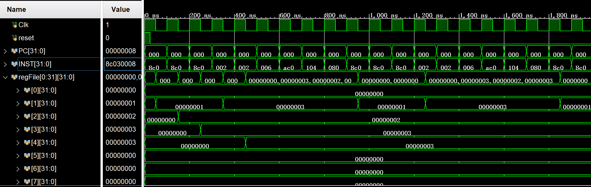
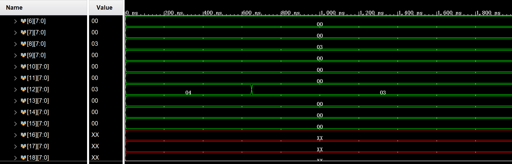

## **MIPS Single-cycle Implementation**

### Target

* Complete the design of single cycle MIPS processor

### Module Description

#### Instruction memory

The instruction memory is a read only memory and cannot be modified, so it is a combined logical unit. Instruction memory is addressed by byte, and one instruction occupies four address storage spaces. This is to coordinate with subsequent PC+4, immediate left shift of two bits as jump address and other operations.

```verilog
module InstMemory(
    input [31:0] address,
    output [31:0] instruction
);

    reg [7:0] instrFile[0:63];

    assign instruction = {instrFile[address+3], instrFile[address+2], 
                          instrFile[address+1], instrFile[address]};

endmodule
```

#### Data selector

```verilog
module Mux32(
    input sel,
    input [31:0] in1,
    input [31:0] in0,
    output [31:0] out
);

    assign out = sel ? in1 : in0;

endmodule
```

#### Register

Registers are high-speed storage components with limited storage capacity. They can be used to temporarily store instructions, data and addresses. Registers are the main object of instruction operations. There are 32 32-bit general-purpose registers in MIPS processor.

```verilog
module Registers(
    input Clk,
    input [25:21] readReg1,
    input [20:16] readReg2,
    input [4:0] writeReg,
    input [31:0] writeData,
    input regWrite,
    output [31:0] readData1,
    output [31:0] readData2
);

    reg [31:0] readData1;
    reg [31:0] readData2;

    reg [31:0] regFile[31:0];
    always @ (readReg1 or readReg2 or writeReg)
        begin
            if (readReg1)
                readData1 = regFile[readReg1];
            else 
                readData1 = 0;
            if (readReg2)
                readData2 = regFile[readReg2];
            else 
                readData2 = 0;
        end

    always @ (negedge Clk)
        begin
            if (regWrite)
                regFile[writeReg] = writeData;
        end

endmodule
```

#### Memory

The data memory module is similar to the register module, and the signal synchronization should also be considered when writing data. The implementation code and register are basically the same.

```verilog
module DataMemory(
    input Clk,
    input [31:0] address,
    input [31:0] writeData,
    input memWrite,
    input memRead,
    output [31:0] readData
);

    reg [7:0] memFile[0:31];
    reg [31:0] readData;


    always @ (address or memRead)
        begin
            if (memRead)
                readData = {memFile[address+3], memFile[address+2], 
                            memFile[address+1], memFile[address]};
            else
                readData = 0;
        end        

    always @ (negedge Clk)
        begin
            if (memWrite)
                begin
                    memFile[address] <= writeData[7:0];
                    memFile[address+1] <= writeData[15:8];
                    memFile[address+2] <= writeData[23:16];
                    memFile[address+3] <= writeData[31:24];
                end
        end

endmodule
```

#### PC

```verilog
reg [31:0] PC;
wire [31:0] INST;
InstMemory instMem(.address(PC), .instruction(INST));
```

#### Control module

The high 6 bits of the read command will output the control signal.

```verilog
wire REG_DST, JUMP, BRANCH, MEM_READ, MEM_TO_REG, MEM_WRITE, ALU_SRC, REG_WRITE;
wire [1:0] ALU_OP;
Ctr mainCtr(.opCode(INST[31:26]), .regDst(REG_DST), .jump(JUMP), .branch(BRANCH), 
            .memRead(MEM_READ), .memToReg(MEM_TO_REG), .aluOp(ALU_OP),
            .memWrite(MEM_WRITE), .aluSrc(ALU_SRC), .regWrite(REG_WRITE));
```

#### Register

Select whether the target register to be written is `Rt` or` Rd` according to `RegDst`, determine the target register to be read according to the `Rs` and `Rt` bits of the instruction, perform the read and write operations, and respond to the reset signal at the same time.

```verilog
wire [4:0] WRITE_REG;
wire [31:0] READ_DATA_1, READ_DATA_2, REG_WRITE_DATA;
Mux5 writeRegMux(.sel(REG_DST), .in1(INST[15:11]), .in0(INST[20:16]), .out(WRITE_REG));
Registers regs(.Clk(Clk), .readReg1(INST[25:21]), .readReg2(INST[20:16]), 
               .writeReg(WRITE_REG), .writeData(REG_WRITE_DATA) , .reset(reset), 
               .regWrite(REG_WRITE), .readData1(READ_DATA_1), .readData2(READ_DATA_2));
```

#### ALU

Extend the low 16 bit symbols of the instruction, send the low 6 bits and `ALUOp` of the instruction to `ALUCtr` for decoding, and select the source of the second ALU operand according to `ALUSrc`. Send `ALUCtr`'s output signal and two operands to ALU, and output the operation result and zero flag bit.

```verilog
wire [31:0] IMM_SEXT, ALU_SRC_B, ALU_RESULT;
wire [3:0] ALU_CTR_OUT;
wire ZERO;
Signext signext(.inst(INST[15:0]), .data(IMM_SEXT));
ALUCtr aluCtr(.funct(INST[5:0]), .aluOp(ALU_OP), .aluCtrOut(ALU_CTR_OUT));
Mux32 aluSrcMux(.sel(ALU_SRC), .in1(IMM_SEXT), .in0(READ_DATA_2),.out(ALU_SRC_B));
Alu alu(.in1(READ_DATA_1), .in2(ALU_SRC_B), .aluCtr(ALU_CTR_OUT), .zero(ZERO), 
        .aluRes(ALU_RESULT));
```

#### Data Memory

Decide whether to read/write according to `MemRead` and` MemWrite`, use the ALU operation result as the address of the data memory, and use the second data read from the register as the written data of the data memory. The `MemToReg` determines whether the data written back to the register comes from the memory or the ALU operation result.

```verilog
wire [31:0] MEM_READ_DATA;
DataMemory dataMem(.Clk(Clk), .address(ALU_RESULT), .writeData(READ_DATA_2), 
                   .memWrite(MEM_WRITE), .memRead(MEM_READ), .readData(MEM_READ_DATA));
Mux32 regWriteMux(.sel(MEM_TO_REG), .in1(MEM_READ_DATA), .in0(ALU_RESULT), 
                  .out(REG_WRITE_DATA));
```

#### Jump logic

Determines the value of the next PC. The PC value may come from the conditional jump address specified by PC+4, the `beq` instruction, or the unconditional jump address specified by the `j` instruction.

```verilog
wire [31:0] PC_PLUS_4, BRANCH_ADDR, SEL_BRANCH_ADDR, JUMP_ADDR, NEXT_PC, SEXT_SHIFT;
assign PC_PLUS_4 = PC + 4;
assign JUMP_ADDR = {PC_PLUS_4[31:28], INST[25:0] << 2};
assign SEXT_SHIFT = IMM_SEXT << 2;
assign BRANCH_ADDR = PC_PLUS_4 + SEXT_SHIFT;
Mux32 branchMux(.sel(BRANCH & ZERO), .in1(BRANCH_ADDR), .in0(PC_PLUS_4), 
                .out(SEL_BRANCH_ADDR));
Mux32 jumpMux(.sel(JUMP), .in1(JUMP_ADDR), .in0(SEL_BRANCH_ADDR), .out(NEXT_PC));

always @ (posedge Clk)
    begin
        if (reset)
            PC <= 0;
        else
            PC <= NEXT_PC;
    end
```

## Simulation test

### Test program

The current single cycle processor can execute the six instructions provided in the guide book. Next, use these six instructions to write a simple program to test whether the processor works normally.

```asm
START:
lw	$1, 0($0)
lw 	$2, 4($0)
lw	$3, 8($0)
OP:
add	$1, $1, $2
or	$4, $1, $2
slt	$5, $3, $4
sw	$4, 12($0)
beq	$2, $3, OP
j	START
```

Initialized values in the data register are:

```
0x00-0x03	1
0x04-0x07	2
0x08-0x0B	3
0x0C-0x0F	4
```

At the beginning of the procedure, perform the following main steps:

1. Load data 1, 2 and 3 into registers`$1`,` $2` and` $3` respectively;
2. `add`, `or`, `slt` and other operations are performed on the operands in the register. The value stored in `$1 `and `$4` should be 3, and the value stored in `$5` should be 0;
3. Store the data in `$4` (i.e. 3) in `0x0C-0x0F` of the data storage;
4. Whether to jump to OP depends on whether the data in` $2 `and `$3` are equal. Since the data stored in` $2` is 2 and the data stored in` $3` is 3, they must not be equal, so the instruction will not jump;
5. Unconditional jump to START

### Signal Stimulus

Assemble the instructions into binary code, load the instructions and data into the corresponding registers, set the clock cycle to 100 ns, and keep the reset signal high level at 25 ns.

```verilog
module Top_tb();
    
    reg Clk, reset;
    always #50 Clk = !Clk;

    Top top(.Clk(Clk), .reset(reset));

    initial begin
        $readmemh("data.txt", top.dataMem.memFile);
        $readmemb("code.txt", top.instMem.instrFile);
        Clk = 1;
        reset = 1;
        #25
        reset = 0;
    end

endmodule
```

### Simulated waveform





The first picture shows the contents of the register, and the second picture shows the contents of the data memory. It is observed that the simulation waveform meets the expectation, and the single cycle processor passes the simulation test.
